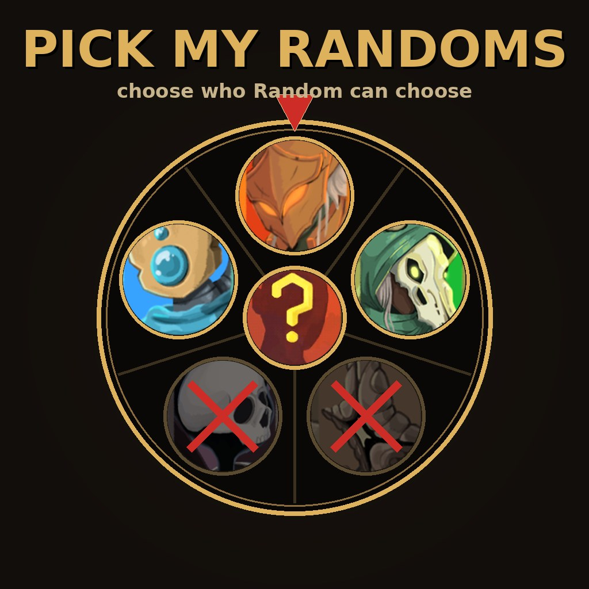

# Pick My Randoms

A Slay the Spire 2 mod: right-click characters on the select screen to exclude them from the Random pool. Love random, skip the ones you're burned out on.

## Features

- Right-click any character portrait to exclude/include it from Random
- Excluded portraits are dimmed - your pool is always visible at a glance
- Exclusions are saved between sessions
- Works with modded characters - they join the pool and can be excluded like anyone else
- Direct character selection is never affected
- Singleplayer only for now (multiplayer random stays vanilla to avoid desyncs - a synced version is being explored)

## Install

**Steam Workshop (easiest):** subscribe [here](WORKSHOP_LINK_HERE) and you're done.

**Manual:** grab the latest release, drop the `PickMyRandoms` folder into `Slay the Spire 2/mods/`.

Requires [BaseLib](https://steamcommunity.com/sharedfiles/filedetails/?id=3737335127).

## How it works

The game resolves "Random" deterministically from the run seed on every client. This mod intercepts the resolution in singleplayer and re-rolls when the vanilla pick lands on an excluded character. In multiplayer the roll stays vanilla, because a filtered roll on one client would desync character selection across machines.

## Building from source

.NET 9 SDK + Slay the Spire 2 installed. `dotnet build` compiles and deploys to the game's mods folder; `dotnet publish` (needs Godot 4.5.1 .NET, path in `Directory.Build.props`) also packs assets.

## See also

- [Better Player Cursors](https://github.com/epicconnnnor/STS2_BetterPlayerCursors) - my other mod: character-colored cursors and player markers for multiplayer

## Thanks

- [Alchyr](https://github.com/Alchyr) for BaseLib and the mod template
- The StS2 modding community

## License

<<<<<<< HEAD
MIT
=======
MIT
>>>>>>> 6e27b901e379549309c02e6de0086ceeaad1a710
